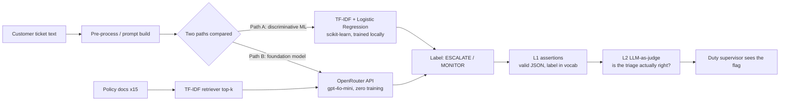

# PE6201 End-of-Course Project — Bank Customer-Ticket Triage Assistant

**Author:** WANG KENAN (G2604062F), Section B · Nanyang Technological University, MSc Enterprise AI

---

## 1. Persona

**Sarah, back-office shift supervisor at a retail bank.** She finishes her afternoon shift and must read every incoming customer-complaint ticket to decide which ones need urgent human review. She does not want to read raw model reasoning; she wants one clear flag per ticket — **ESCALATE** or **MONITOR** — so she only manually reviews the flagged ones. The system never makes the final decision; it only triages.

## 2. Input / Output

| | |
|---|---|
| **Input** | A raw customer complaint ticket (free English text), e.g. *"$800 disappeared from my account overnight"* |
| **Output** | Structured JSON: `{"label": "ESCALATE"|"MONITOR", "reason": "<one short sentence>"}` |
| **Adjacent capability** | A small RAG layer answers policy questions (e.g. "how long do I have to report fraud?") over 15 bank-policy documents |

## 3. High-level Architecture



External intelligence used: rented `openai/gpt-4o-mini` via the OpenRouter API (model layer is rented; data handling, prompt design, and the eval harness are owned).

## 4. Metrics — Targeted vs Reached

| Metric | Targeted | Reached (measured) |
|---|---|---|
| Triage accuracy — sklearn | baseline ≥0.85 | **1.000** (100 held-out tickets) |
| Triage accuracy — LLM API | match baseline | **1.000** |
| sklearn latency | <10 ms | **0.003 ms / ticket** |
| API latency | report real figure | **1.29 s / ticket avg** |
| API cost per call | keep negligible | **$0.000018** |
| Eval L1 pass rate (structured prompt) | 100% | **100%** (v1 weak prompt: 0%) |
| Eval L2 pass rate | ≥90% | **100%** |
| RAG correct policy answers | 5/5 | **5/5** (1 documented failure, see report) |

## 5. How to run

```bash
# 1. install deps
pip install pandas numpy scikit-learn requests openai nbformat

# 2. set your OpenRouter key
set OPENROUTER_API_KEY=sk-or-...

# 3. (optional) regenerate the labelled dataset
python code/make_data.py

# 4. run the three experiments
python code/part1.py     # sklearn vs API classification
python code/part2.py     # minimal RAG over policy docs
python code/part3.py     # prompt + L1/L2 evaluation harness
```

Results print to console and save as `part1_results.json`, `part2_results.json`, `part3_results.json`.

## 6. Repository layout

```
.
├── README.md                 <- this file
├── problem_statement.pdf     <- Milestone 1
├── report.pdf                <- business & technical trade-off analysis (<=1200 words)
├── code/
│   ├── make_data.py          <- generates the labelled complaint dataset
│   ├── part1.py              <- sklearn vs foundation-model comparison
│   ├── part2.py              <- minimal RAG over 15 policy documents
│   └── part3.py              <- prompt evaluation harness (L1 + LLM-as-judge L2)
├── data/
│   ├── complaints.csv         <- 400 labelled tickets
│   └── README_data.md         <- data explainer
└── evals/
    ├── eval_cases.json        <- 10 held-out eval cases
    └── README_evals.md        <- eval explainer
```

## 7. Build vs Buy (one line)

Model and compute are **rented**; the labelled data pipeline, prompt design, and the L1/L2 evaluation harness are **owned** — those are the parts that carry the project's judgement and cannot be rented.
